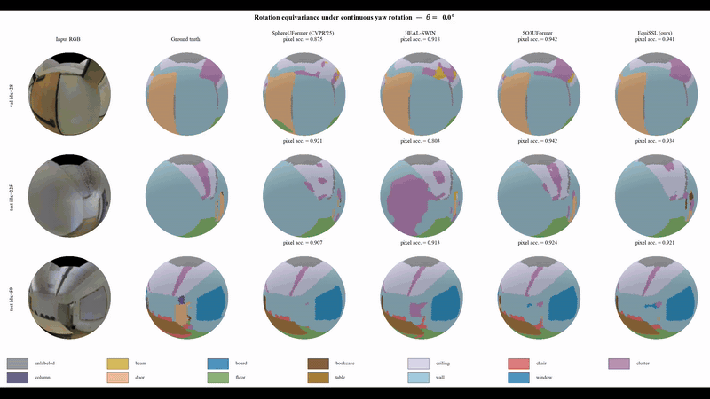
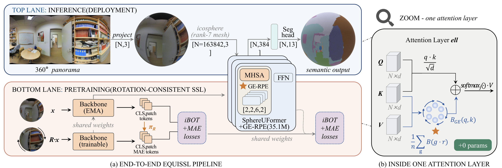

# EquiSSL

**Code for [Gauge-Equivariant Attention for Rotation-Stable 360° Scene Understanding](https://doi.org/10.1145/3842525)**

ACM Transactions on Graphics 45(6), Article 242, SIGGRAPH Asia 2026.



[Download the original MP4 (15.5 s)](https://github.com/Jaywalk18/equissl-release/raw/refs/heads/main/assets/fast_forward.mp4)

## Overview

GE-RPE averages relative-position bias lookups across a finite cyclic set of tangent-frame rotations. The full EquiSSL system adds rotation-consistent iBOT+MAE pretraining with teacher-token alignment. The finite-gauge bias is invariant to the chosen cyclic subgroup; end-to-end SO(3) robustness on a discretized icosphere is evaluated empirically.



## Installation

The code expects Linux, Python 3.10 or newer, a CUDA-capable PyTorch installation, and the external SphereUFormer source tree. Install PyTorch for your CUDA version first; then from this repository's root:

```bash
git clone https://github.com/Jaywalk18/equissl-release.git
cd equissl-release
python -m venv .venv
source .venv/bin/activate
python -m pip install -r requirements.txt
python -m pip install -e .

export SPHERE_UFORMER_SRC=/absolute/path/to/sphere_uformer/src
export STANFORD2D3D_PATH=/absolute/path/to/Stanford2D3D/extracted
export STRUCTURED3D_PATH=/absolute/path/to/Structured3D
```

`SPHERE_UFORMER_SRC` must contain `trimesh_utils.py` and `network/`; its `data/` directory must contain the Stanford2D3D split, label-map, and mask files used by SphereUFormer. Dataset paths must point to extracted datasets. The code reads these environment variables at runtime; the strings in YAML configurations are expanded using `STRUCTURED3D_PATH`. Run all commands below from the repository root.

This repository does **not** bundle SphereUFormer, datasets, or pretrained checkpoints. The experiment launchers under `scripts/` record original cluster workflows and often contain cluster-specific GPU, output, or temporary paths. Use the root `main_*.py` commands below for a new environment.

## Quick start

The commands below use `configs/pretrain_v9_repaired.yaml`, a retained 35.1M-parameter GE-RPE C6 experiment recipe. It is an **example workflow**, not an exact reconstruction of the paper's canonical run. In particular, this YAML enables area weighting and uses a 0.5 mask ratio, while the paper's canonical GE-RPE configuration omits area weighting and describes a 0.75 mask ratio. The repository does not include the canonical training checkpoint or a complete run manifest. Match the configuration to the checkpoint and protocol you actually use; the smaller `configs/pretrain.yaml` does not match a v9 checkpoint.

**1. Pretrain on Structured3D**

```bash
torchrun --nproc_per_node=1 main_pretrain.py \
  --config configs/pretrain_v9_repaired.yaml \
  --output_dir outputs/pretrain_v9
```

Set `--nproc_per_node` to the number of GPUs assigned to the run. The training command creates checkpoints under its output directory; this is a full training run, not a quick smoke test.

**2. Fine-tune segmentation on Stanford2D3D**

```bash
python main_finetune_seg.py \
  --config configs/pretrain_v9_repaired.yaml \
  --pretrained outputs/pretrain_v9/<checkpoint>.pth \
  --data_dir "$STANFORD2D3D_PATH" \
  --output_dir outputs/finetune_seg
```

Replace `<checkpoint>.pth` with an actual checkpoint produced by the preceding run. For staged fine-tuning, consult `configs/finetune_2stage.yaml` and the original `scripts/finetune_2stage.sh`; that launcher needs local path review before reuse. Add `--no_area_weight` to fine-tuning and evaluation only when the checkpoint and intended protocol use the no-area architecture.

**3. Evaluate rotation robustness**

```bash
python main_eval_rotation.py \
  --config configs/pretrain_v9_repaired.yaml \
  --checkpoint outputs/finetune_seg/best_model.pth \
  --data_dir "$STANFORD2D3D_PATH" \
  --split val --max_angle 90 \
  --num_rotations 10 --num_repeats 3
```

The historical `tools/eval_pose35.py` entry point remains available as a compatibility wrapper and also handles 90° evaluation. Use `--split test` for the held-out test set. See the [benchmark protocol](docs/benchmark_protocol.md) before comparing a result with the paper: checkpoint selection, split, label mapping, and rotation sampling must match.

Additional entry points: `tools/finetune_depth.py` for depth and `tools/eval_s3d_zeroshot.py` for Structured3D transfer. Pass the matching model config and task-specific dataset/checkpoint paths. `python main_pretrain.py --help` and the other entry points list their options after the external dependencies are installed.

## Citation

If this code supports your research, cite the paper. GitHub's **Cite this repository** button uses [`CITATION.cff`](CITATION.cff).

```bibtex
@article{zhou2026gauge,
  title   = {Gauge-Equivariant Attention for Rotation-Stable {360$^\circ$} Scene Understanding},
  author  = {Zhou, Tianjian and Li, Yishan and Jiang, Jie and Zhang, Yifei},
  journal = {ACM Transactions on Graphics},
  volume  = {45},
  number  = {6},
  year    = {2026},
  note    = {Article 242},
  doi     = {10.1145/3842525}
}
```

## License

The repository code is released under the [MIT License](LICENSE). SphereUFormer and datasets remain subject to their own terms.
